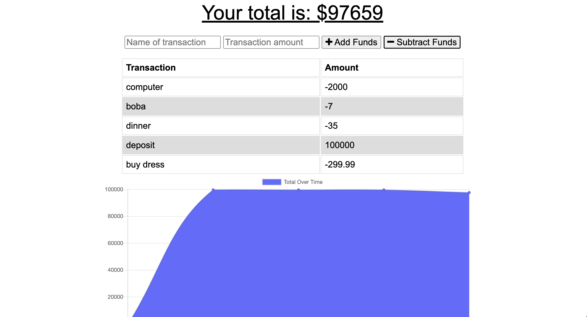

# BUDGET-TRACKER

## Purpose

The goal of this project was to update an existing budget tracker application to allow for offline access and functionality. The user of this application is able to add expenses and deposits to their budget with or without a connection. If the user enters transactions such as deposits and expenses offline, the total will be updated when they're brought back online. This aplication uses a service worker, a web manifest, IndexedDB for offline functionality, has a server and uses MongoDB as its database. This application is deployed on Heroku using MongoDB Atlas.

## Installlation

1. Install node.js

2. Install required dependencies by opening a terminal and on command line type:

```shell
npm init -y
npm install
```

## Usage

To use the application locally, type the following:

```shell
npm start
```

## Screenshot



[Link to deployed application on Heroku)(https://immense-fortress-56219.herokuapp.com/)

## Built With

- Express.js
- Node.js
- MongoDB
- Mongoose ODM

## License

[](https://opensource.org/licenses/MIT)

## Contribution

Made with ❤️ by
Joanne Chun
